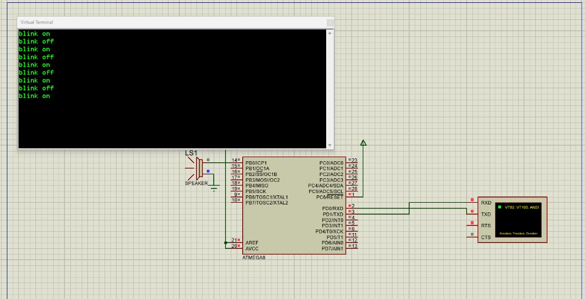

# ATmega8 в Proteus

Хост пишет Intel HEX. Proteus его только открывает. Внешний `avra` не вызывается.

Сборка из каталога проекта:

```bash
cd projects/soc_atmega8 && fsoc --build
cd projects/soc_atmega8_blink && fsoc --build
cd projects/baremetal/blinky_atmega && fsoc --build
```

`soc_atmega8` — Forth-консоль (`sys: fsys`): kernel и `fsys/avr/extra-min.4th`, без портов. `soc_atmega8_blink` — release-образ: `image: release`, `fsys/avr/extra.4th` и `firmware/blink.fs`. `blinky_atmega` — та же задача `blinky`, `cpu: avr`, светодиод `PB0`, без kernel. Таргет `proteus` не запускает симулятор: в каталоге остаётся `firmware.hex`. Log консоли: `atmega8(avr)`, `image tool: fsys`, `extra-min.4th`. Log blink: `extra.4th`, `release.4th`, затем `firmware.hex: N bytes of 8192`.

Схема ISIS:

- Корпус ATMEGA8. В свойствах Clock Frequency — 8 МГц. Фьюзы в HEX нет.
- Светодиод с резистором от `PB0` к земле. Программа ставит высокий уровень.
- Virtual Terminal, 9600 бод. TX терминала на `PD0` (RXD), RX терминала на `PD1` (TXD). Enter в VT100 — обычно CR (`13`); консоль принимает и CR, и LF.
- Program File — свежий `firmware.hex` после `fsoc --build`. Если Proteus пишет `Read total of 2036 bytes`, это старый файл.

На Linux до Proteus: **simavr** (`sudo apt install simavr`). Голый CLI USART на клавиатуру не сажает — после `ok` прошивка ждёт `KEY`. Консоль:

```bash
sudo apt install simavr libsimavr-dev   # headers: libsimavr-dev
cd projects/soc_atmega8 && fsoc --build
"$FSOC_HOME/tools/avr-con" ./firmware.hex           # интерактив: строка + Enter
"$FSOC_HOME/tools/avr-con" ./firmware.hex words 1   # одна или несколько команд
```

Без `libsimavr-dev` сборка ищет заголовки в `/tmp/simavr-dev/usr/include/simavr`. GDB: `simavr -g -m atmega8 -f 8000000 firmware.hex`, затем `avr-gdb` и `target remote :1234` (у HEX нет символов, PC в байтах). Ещё **simulavr** и **qemu-system-avr**.

Сброс — включение питания в Proteus. Прерывания программа не включает, первая команда стоит по вектору сброса.

`soc_atmega8_blink` в Proteus 8.13 (AVR 8.3SP0), 8 МГц, Virtual Terminal 9600. На `PB0` — пищалка. UART: TX терминала на `PD0` (RXD), RX на `PD1` (TXD). Строки `blink on` / `blink off` идут с переводами строки (`itype` + `cr`).


