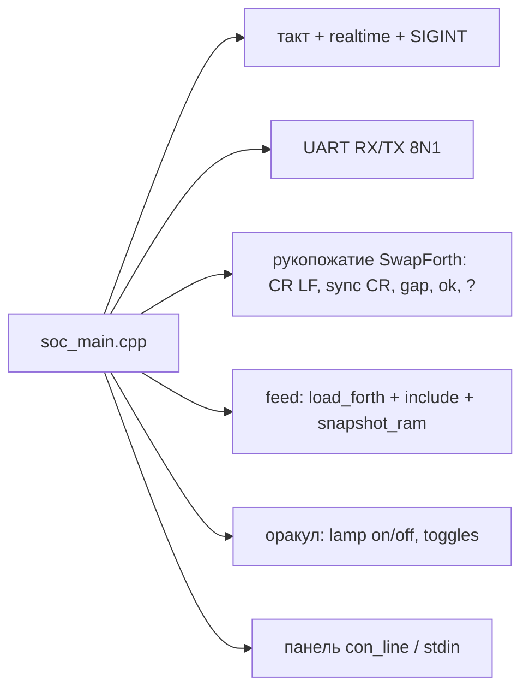

# Design

## Context

См. proposal.md — Why. Verilator 4.038: `#delay` игнорируется, такт ведёт C++. `sim.sh` компилирует `top.v`, `*.cpp`, `*.cc` из каталога проекта с `-I..`. `j1_wrap.v` держит `ram` как `verilator public_flat`. `buart` вендорный: `CLKFREQ 12 MHz`, `BAUD 115200` → 104 такта на бит; эмуляция ведёт такт 50 МГц, поэтому «бод» в эмуляции условный.

Роли `soc_main.cpp` сегодня:

## Goals / Non-Goals

**Goals:**

- `emu/` не содержит имени задачи, текста прошивки, имён из иерархии дизайна.
- `main` задачи читается за один экран.
- Прошивка собирается инструментом с одним входом и одним выходом.

**Non-Goals:**

- Замена Verilator, VCD, другие симуляторы.
- Прерывания, `BG`, `'IDLE` (см. `doc/stm8ef-hw.md`).
- Реальный бод на плате — `soc-board`; здесь только параметризация делителя.

## Decisions

1. **`emu/clock`: `struct Clock { run(step, stop_pred) }`.** Держит `t` (нс), `cycles`, `cycle_cap` из `FSOC_EMU_CYCLES`, realtime-паузу при `!fast` по событию, SIGINT → 130. `env_int` / `env_str` живут здесь. Blinky и soc вызывают один цикл.

2. **`emu/uart`: `RxShift` / `TxDec` с конструктором `(int bit_clocks)`.** Значение — из параметра `CLK_HZ / BAUD`, которое `sim.sh` передаёт как `-DFSOC_UART_BIT=<n>` из одного места (пока `targets/emulation.4th`; после `iomap` — из карты). Жёсткий `kBit` исчезает.

3. **`emu/script`: сеанс как конечный автомат без знания SwapForth-текста, кроме протокола консоли.** Знает: после сброса ожидать CR LF, послать один CR, ждать паузу, затем отдавать строки; конец ответа — ` ok` CR LF или `?` с паузой. Это протокол консоли SwapForth, он относится к сеансу, не к прошивке; вынесен в один класс `Session` с методами `on_tx_byte`, `next_rx_level`, `done()`. Источник строк — интерфейс: `EnvLines` (`FSOC_EMU_UART_IN`), `StdinLines` / панель (`con_line`).

4. **Оракулы — в тестах.** `soc_blink_test` проверяет `lamp on` / `lamp off` в `term`-журнале и `pin led 0` / `pin led 1` в `pin`-журнале уже сейчас; `main` дублирует это ради кода выхода. Быстрый прогон без скрипта ограничивается `FSOC_EMU_CYCLES` (значение в тесте, достаточное для двух переключений при периоде 30). Альтернатива — оставить `saw_on` ради «умного» кода выхода — это и есть утечка прошивки в эмулятор.

5. **`soc_feed` — отдельный `main`, снимок делает Verilog.** `j1_wrap.v` получает вход `dump`; `always @(posedge clk) if (dump) $writememh("firmware.hex", ram)`. `soc_feed` подаёт строки плоского файла через `Session`, по `done()` поднимает `dump` на один такт и выходит 0. Имени `top__DOT__u__DOT__ram` в C++ нет. Плоский файл (`include` раскрыты) готовит `fsoc/tasks/soc.4th` — Forth умеет читать файлы и знает, где лежит `swapforth/common/`. Альтернатива `--public-flat-rw` + DPI тоже уводит имена иерархии в C++.

6. **Один `sim.sh` на два бинаря.** `targets/emulation.4th` собирает `Vtop` дважды с разным `main`? Нет: собирается одна библиотека `obj_dir/Vtop__ALL.a` и два исполняемых файла `obj_dir/Vtop` (интерактив) и `obj_dir/Vtop_feed`. `sim.sh` получает список `main`-файлов от таргета по содержимому каталога: `*_main.cpp` → интерактив, `*_feed.cpp` → feed. Blinky `feed` не имеет — собирается только интерактив.

## Risks / Trade-offs

- [`$writememh` пишет относительно cwd симуляции] → `sim.sh` уже делает `cd` в каталог проекта; тест сверяет число строк 4096.
- [Протокол консоли SwapForth в `emu/script` — всё же знание о прошивке] → это протокол сеанса, общий для любого Forth с ` ok`; параметры (`ok`-суффикс, символ ошибки) — поля `Session`, не литералы задачи.
- [Изменение параметров `buart` меняет тайминг сеанса в тестах] → делитель в эмуляции остаётся 104 до `soc-board`; меняется только способ его передачи.
- [Тесты `FSOC_EMU_FAST` без оракула могут крутиться дольше] → `FSOC_EMU_CYCLES` в тестах; период `h# 800` в `lamp.fs` мал.

## Migration Plan

1. `emu/clock`, `emu/uart` — извлечение без изменения поведения; `blinky_main` на `clock`.
2. `emu/script` + `Session`; `soc_main` на них; оракулы в тесты; `FSOC_EMU_CYCLES`.
3. `dump` в `j1_wrap.v`, `soc_feed.cpp`, плоский feed в Forth; удалить `FSOC_EMU_SNAPSHOT`, `load_forth`, `snapshot_ram`.

Откат по шагам; каждый шаг держит `fmix test` зелёным.

## Open Questions

Нет.
