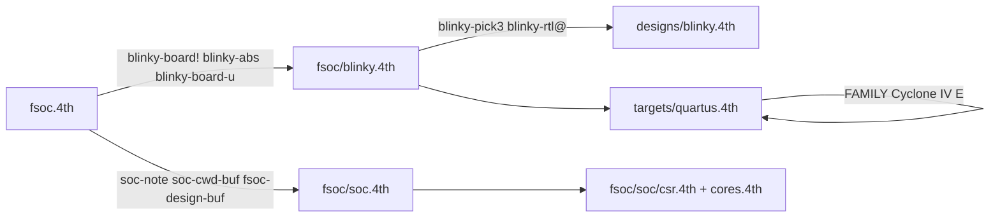
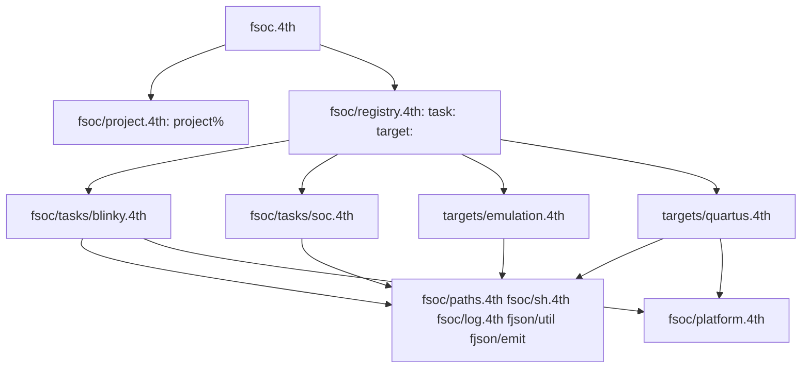

# Design

## Context

См. proposal.md — Why. Зависимости сейчас:

Целевые зависимости:

Ограничение образа Gforth: fsoc грузит `fenum-bs.4th` (`begin-structure` / `field:`). `fjson/node.4th` и `tree` построены на `struct.fs`, который ломает `field:` в том же образе (см. README fenum). Поэтому подключаются только `fjson/util.4th` и `fjson/emit.4th`; `fjson.4th` целиком — нет.

## Goals / Non-Goals

**Goals:**

- Ни одно слово `fsoc.4th` не начинается с имени задачи или таргета.
- Ни одно слово задачи не пробует несколько относительных префиксов.
- Общие операции (строка, файл, оболочка, список, лог) — из ядра или из feco, не по копии на задачу.
- Тесты не трогают `projects/*` пользователя.

**Non-Goals:**

- Контракт с fhdlgen (`FSOC_*_TOP`, печать include) — `design-out-contract`.
- Разрез `soc_main.cpp` — `emu-lib`.
- Карта адресов и судьба `cores.4th` — `iomap`. Здесь `csr.4th` только переводится на `ulist-each` и `fjson.emit-*`.
- Новые таргеты (yosys, Icarus как таргет).

## Decisions

1. **Манифест — структура `project%`, а не набор глобальных буферов.** Поля: `task$`, `target$`, `board$`, `design$`, `dir$`, `opts` (`ulist` пар имя→значение). Слова `task:` … `option:` — `parse-name` не используют: `s" soc" task:` сохраняет привычный вид `target.4th` и совместим с `included`. Альтернатива — оставить `fsoc-task!`-семейство и просто перенести его в ядро — сохраняет пять буферов и `blinky-board!`-алиас. `soc-lamp-on` становится `s" lamp" s" 1" option:`; задача читает `s" lamp" project.opt@`.

2. **Реестр на `ulist` записей `{ name$, emit-xt, run-xt, load-xt }`.** `task:` и `target:` — обычные слова определения времени загрузки; задача регистрирует себя в конце своего файла. `fsoc.4th` ищет запись по имени из манифеста и `execute`. Альтернатива — `find-name` по склеенному имени — это и есть текущая утечка. Неизвестное имя — `abort" unknown task"` / `abort" unknown target"` до любого `emit`.

3. **Хуки таргета: `emit ( project -- )`, `run ( project -- )`, `load ( project -- )`.** emulation: `emit` пишет `sim.sh`, `run` — `sh sim.sh` с обработкой кода 130 (сейчас в `fsoc-do-build`), `load` — `noop`. quartus: `emit` пишет `.qsf` `.sdc` `build.sh` `load.sh`, `run` — `noop`, `load` — `sh load.sh`. Порядок `--build`: `task.emit` (листы, дизайн, прошивка, `request`, `quartus-map`), затем `target.emit`, затем `target.run`. Так задача не знает, чем её запускают, а таргет — что он собирает.

4. **Пути только от `FSOC_HOME`.** `fsoc-path ( c-addr u -- c-addr u )` = `$FSOC_HOME/<rel>`, результат — выделенная строка. `cwd` — каталог проекта, читается один раз в `project.dir$` через `get-dir`. `included` получает абсолютные пути. Тесты выставляют `FSOC_HOME` = корень репозитория в `tests/load.4th` (через `getenv` с fallback на `../`), после чего `s" fsoc/load.4th" fsoc-path included`. Альтернатива — искать вверх по дереву `package.4th` — скрытая магия, которую запрещает правило «нижний слой не подставляет каталог верхнего».

5. **Строки — `fjson/util.4th`.** `fjson.str-concat` возвращает новую строку; освобождение — `fjson.str-free`. Правило в коде: слово, получившее выделенную строку и не вернувшее её, освобождает её само. Длинные тексты (`sim.sh`, `.qsf`, `csr.4th`) пишутся построчно через `fjson.emit-to-file` + `fjson.emit`, без сборки в памяти. `fsoc-store` / `fsoc-fetch` (блок с длиной в первой ячейке) остаются: это формат полей структур, fjson его не даёт.

6. **Обходы списков — `ulist-each` с xt и переменной-аккумулятором.** `io-find` и `request-all` в `platform.4th`, экспорт в `csr.4th`. Внутренние `ulist-head` / `unode-*` в fsoc не упоминаются; flint тогда не видит fsoc как клиента внутренностей fenum.

7. **Семейство — свойство платы.** `plat-family ( c-addr u -- )` в Platform DSL, `plat.family@`; три платы получают значение (`Cyclone IV E`, `Cyclone IV E`, `Cyclone II`). Quartus без семейства — `abort" quartus-write: no family"`.

8. **Тесты во временном каталоге.** `test-setup` делает `mktemp -d`, копирует туда `target.4th` проекта, `test-teardown` удаляет. Прогон билдера — `cd <tmp> && FSOC_HOME=<root> bin/fsoc --build`. `expect-stack-clean` в конце каждого тестового файла ловит мусор от `included` платы, который сейчас чистится циклом в `blinky-on-board`; сам цикл удаляется, и если `included` платы или `request` оставляют элементы, это исправляется в источнике.

## Risks / Trade-offs

- [Переписывание пяти `target.4th` ломает пользовательские копии] → `target.4th` коммитятся, формат меняется одним коммитом; `fsoc` на старом формате падает на первом же `fsoc-task!` с `undefined word`, что видно сразу.
- [`fjson/emit.4th` держит один текущий файл вывода] → писать файлы последовательно, закрывать через `fjson.emit-to-stdout` после каждого; параллельной записи в билдере нет.
- [`ulist-each` не даёт досрочного выхода для `io-find`] → аккумулятор «первое совпадение» и пропуск остальных; списки плат — десятки элементов.
- [Регистрация в реестре зависит от порядка `included`] → `fsoc/load.4th` грузит ядро, платформу, таргеты, задачи в этом порядке; `fsoc.4th` вызывает реестр только после `load.4th`.

## Migration Plan

1. Ядро (`paths`, `sh`, `log`, `project`, `registry`) рядом со старым кодом, тесты ядра зелёные.
2. Таргеты на хуки; `fsoc.4th` на манифест + реестр; старые слова удаляются в том же коммите, `target.4th` переписаны.
3. Задачи переезжают в `fsoc/tasks/`, дубли удаляются; `flint --strict --project-only` чистый.
4. `platform.4th` и `csr.4th` на `ulist-each` и `fjson`.
5. Тесты на `TS{ }ST`, временные каталоги, `expect-stack-clean`.

Откат — по шагам, каждый коммит самодостаточен.

## Open Questions

Нет.
